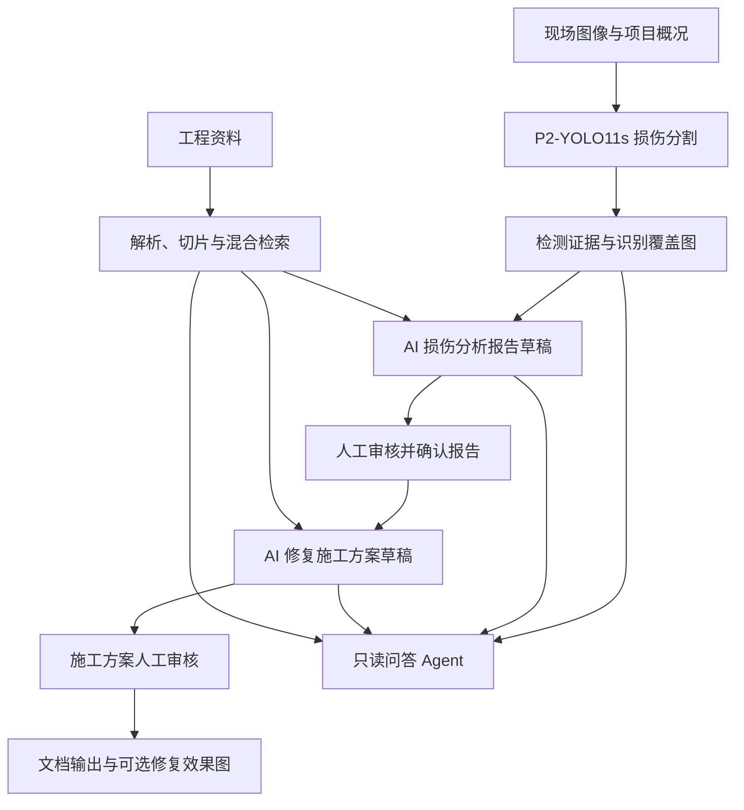

# 结构损伤智能分析Agent

面向混凝土构件表观损伤的桌面分析工具，集成 **P2-YOLO11s 实例分割、工程知识库 RAG、多模态报告生成、人工审核、修复施工方案和只读问答助手**。项目将检测图像、结构化证据与参考资料串联起来，帮助工程人员整理可追溯的分析材料。

> 检测与生成结果属于辅助分析材料。损伤等级、修复方案和结构安全结论需要专业人员结合现场检测复核；软件中的人工确认不等同于施工放行或结构安全鉴定。

## 核心功能

- **损伤识别**：对单张图像或图像目录执行分割，输出类别、置信度、掩膜覆盖图与结构化检测结果。
- **损伤分析报告**：结合原图、识别覆盖图、项目概况和选定知识库资料，通过兼容 OpenAI Responses API 的服务生成结构化报告。
- **人工审核流程**：报告草稿经人工确认后才可生成施工方案；施工方案也具有独立审核状态。
- **工程知识库**：导入 PDF、DOCX 等资料，支持文件夹分类、扫描 PDF OCR、结构化切片、来源定位和范围内检索。
- **混合检索**：使用 SQLite FTS5/BM25、标准号和条款号等确定性通道，以及本地 BGE 语义召回；支持层级上下文扩展与确定性重排。
- **修复施工方案**：基于已确认报告和参考资料生成工法、材料设备、施工工序、质量、安全及验收草稿。
- **文档输出**：保存 JSON、Markdown 和生成清单；配置 Word 模板后可输出 DOCX，并嵌入原图及识别覆盖图。
- **修复效果图**：可选接入 FHL 或硅基流动图像编辑服务，生成用于沟通和复核的修复示意图。
- **只读 Agent**：支持多个会话，可读取检测、报告和方案，检索知识库及公开网页，进行证据对比；问答助手不修改项目文件。

旧版 `.doc` 文件需先用本机工具转换为 `.docx`，再导入知识库。

## 工作流程



## 模型与技术栈

| 模块 | 当前实现 | 用途 |
| --- | --- | --- |
| 损伤识别 | P2-YOLO11s-seg、Ultralytics、PyTorch | 图像实例分割；正式权重为 `models/best.pt` |
| 文本嵌入 | `BAAI/bge-small-zh-v1.5`、sentence-transformers | 本地工程资料与查询向量编码 |
| 检索存储 | SQLite FTS5、NumPy `.npz` | 词法召回、向量余弦相似度与加权 RRF 融合 |
| 文档解析 | Docling、PyMuPDF、RapidOCR、Camelot、pdfplumber | PDF 版面、文字、OCR 与表格处理 |
| 报告与方案 | 兼容 OpenAI Responses API 的模型服务、Pydantic | 多模态分析与结构化输出校验 |
| 桌面界面 | PySide6 | 检测工作台、设置、知识库与审核对话框 |
| 文档与发布 | python-docx、PyInstaller | Word 模板输出与 Windows 便携打包 |

当前识别模型的八个类别来自 [模型清单](deployment/models/model_manifest.json)：

| 模型类别 | 中文含义 |
| --- | --- |
| `Concrete crushing` | 混凝土压碎 |
| `Delamination` | 脱层 |
| `Microcrack` | 微裂缝 |
| `Minor spalling` | 轻微剥落 |
| `Moderate spalling` | 中度剥落 |
| `Rebar corrosion` | 钢筋腐蚀 |
| `Structural crack` | 结构裂缝 |
| `Structural deformation` | 结构变形 |

类别预测是模型输出，不能单独作为结构安全或损伤严重程度的结论。

## 快速开始

### 1. 获取源码和模型

仓库公开开放，无需申请访问权限。克隆前请安装 Git 与 Git LFS。

```powershell
git lfs install
git clone https://github.com/k1711019707-alt/structural-damage-analysis-agent.git
cd structural-damage-analysis-agent
git lfs pull
```

`models/best.pt` 和 PDF 测试资料通过 Git LFS 管理。若模型文件仍是 LFS 文本指针，先完成 `git lfs pull` 再运行推理。

### 2. 准备 Python 环境

当前开发环境使用 Windows、Conda 和 Python 3.11。依赖快照包含 PyTorch CUDA 12.8 构建；使用 GPU 时需要匹配的 NVIDIA 显卡和驱动。

```powershell
conda env create --name YOLO11-HAI --file environment.yml
conda activate YOLO11-HAI
```

已有 Python 3.11 环境时，也可使用锁定依赖文件：

```powershell
python -m pip install -r requirements-lock.txt
```

这两个文件记录开发环境快照。CPU 部署或不同 CUDA 环境需要调整 PyTorch、torchvision 与 ONNX Runtime 的安装组合；它们不是通用 CPU 安装清单。

### 3. 启动桌面程序

在仓库根目录、已激活环境中执行：

```powershell
python scripts/launch_yolo11s_seg_gui.py
```

也可运行 `start_yolo11s_seg_gui.bat`。脚本优先使用项目内 `YOLO11s\Scripts\python.exe`，不存在时使用当前 PATH 中的 Python。

### 4. 配置并运行分析

1. 在设置中填写 Responses API 地址、应用 API Key 和支持当前请求方式的模型名称。桌面 Codex 登录凭据不能替代应用服务密钥。
2. 导入规范、论文或项目资料，为报告和施工方案分别选择参考范围、提示词及可选 DOCX 模板。
3. 选择图像目录并填写项目概况，运行损伤识别和报告生成。
4. 核对每项损伤证据、判断与不确定性，确认报告后生成施工方案，再审核方案。
5. 查看或导出文档；需要修复效果图时，配置并启用对应图像服务。

## 知识库与嵌入模型

新克隆的仓库不包含开发机上的生产知识库、活动索引、用户资料或嵌入模型权重。首次使用需要导入自己的资料并完成索引同步。BGE 和部分解析模型首次加载可能需要网络下载；离线部署应预先准备对应本地模型。

知识管线可独立运行，以下命令演示单份 PDF 的处理与查询：

```powershell
python -m knowledge_pipeline.pdf_convert input.pdf work/converted.json
python -m knowledge_pipeline.chunk work/converted.json work/chunks.json
python -m knowledge_pipeline.index work/chunks.json work/knowledge.sqlite3 --manifest work/index_manifest.json
python -m knowledge_pipeline.embed work/knowledge.sqlite3 work/semantic.npz --model BAAI/bge-small-zh-v1.5
python -m knowledge_pipeline.retrieve "混凝土结构裂缝如何修复" work/knowledge.sqlite3 work/retrieval.json --semantic-index work/semantic.npz
python -m knowledge_pipeline.rerank work/retrieval.json work/reranked.json
```

嵌入索引只编码用于召回的 child 切片，parent 作为上下文扩展。语义索引包含 chunk ID、内容哈希与语料指纹，查询时检查它与 SQLite 语料是否一致。独立检索在语义通道不可用时保留词法召回并报告告警；GUI 生产同步和活动版本切换还受质量与完整性门禁约束。

离线编码可向 `knowledge_pipeline.embed` 传入 `--model-path`。生产库构建、验证、激活与回滚详见 [生产 RAG 操作说明](knowledge_pipeline/PRODUCTION_RAG_RUNBOOK.md)。普通示例索引不会自动成为 GUI 的生产活动版本。

## 命令行推理与训练

仅运行图像分割，不需要配置报告 API：

```powershell
python -m runtime.yolo_segmentation_runtime --input path/to/images --output runs/inference/example --model models/best.pt
```

CLI 默认使用 GPU `0`；需要 CPU 推理时增加 `--device cpu`。

推理目录包含识别产物与 `summary.json`。配置应用服务后，可从摘要生成报告：

```powershell
$env:DAMAGE_REPORT_API_KEY = "your-application-key"
$env:DAMAGE_REPORT_BASE_URL = "https://api.openai.com/v1"
$env:DAMAGE_REPORT_MODEL = "your-vision-capable-model"
python scripts/generate_damage_report.py runs/inference/example/summary.json
```

API 根地址、模型及输出说明见 [报告生成说明](docs/damage-reporting.md)。

训练数据集未随仓库上传。准备自己的 YOLO 分割数据集，修改 `configs/p2_yolo11s_seg_train.yaml` 中的数据路径及设备参数后，可先检查训练配置：

```powershell
python scripts/train_p2_yolo11s_seg.py --config configs/p2_yolo11s_seg_train.yaml --dry-run
python scripts/train_p2_yolo11s_seg.py --config configs/p2_yolo11s_seg_train.yaml
```

## 项目结构

```text
.
├── runtime/               # 桌面界面、识别、报告、方案、设置与只读 Agent
├── knowledge_pipeline/    # PDF 转换、切片、索引、嵌入、检索和重排
├── scripts/               # 启动、训练、评估、报告与生产知识库脚本
├── models/                # 正式损伤分割权重（Git LFS）
├── deployment/models/     # 模型版本、类别与权重校验清单
├── configs/               # YOLO 架构与训练配置
├── templates/             # Word 模板与施工方案规则
├── benchmarks/            # RAG 基准与评估资料
├── tests/                 # 自动化回归测试
├── packaging/             # Windows 便携版与源码包构建
├── tools/                 # 发布验证与数据转换工具
└── docs/                  # 模块文档与设计记录
```

`knowledge_base/`、`dataset/`、`runs/`、`build/`、`dist/` 及本机配置属于本地数据或生成目录，已被 Git 忽略。

## 测试与发布

在项目环境中执行回归测试：

```powershell
python -m pytest
```

模型、OCR、GUI 和外部服务的实际运行仍取决于部署环境及配置；测试通过不代表现场数据上的检测效果或工程方案已经验收。

Windows 发布入口为 `packaging/build_portable.ps1` 和 `packaging/build_source_release.ps1`。便携打包需要已验证的活动 RAG 版本、嵌入模型资源以及相应运行依赖；参数可查看脚本顶部的 `param` 定义。构建结果生成在 `build/`、`dist/`，不属于此 GitHub 源码仓库的已提交内容。

## 使用边界

- 图像检测针对可见表观损伤，不提供构件内部缺陷、承载力或整体结构安全鉴定。
- 未建立可靠尺度标定时，像素证据不能直接换算为毫米、面积或工程量；报告和方案不能据此虚构数值。
- 检索引用来自选定资料。规范版本、适用范围及关键条款应结合原文复核。
- 模型服务、效果图服务和联网搜索可能向外部供应商发送图像、问题或选定上下文，使用前应确认资料允许上传，并了解供应商费用与数据政策。
- 自动草稿、软件人工确认记录和修复效果图均不能代替现场检测、专业审核、施工审批或验收。

更多说明：[知识管线](knowledge_pipeline/README.md) · [生产 RAG](knowledge_pipeline/PRODUCTION_RAG_RUNBOOK.md) · [统一设置与文档输出](runtime/README-unified-settings.md) · [报告生成](docs/damage-reporting.md)

## 开源许可证

本项目原创代码采用 **GNU Affero General Public License v3.0（AGPL-3.0）**，完整条款见 [LICENSE](LICENSE)。可以在遵守许可证的前提下使用、修改和分发；分发修改版或通过网络向用户提供修改版服务时，须按许可证提供相应源码。

第三方依赖、预训练模型、训练数据和测试 PDF 等资料保留各自的许可证或版权，不能因仓库公开而视为一并获准再分发。具体说明见 [第三方声明](THIRD_PARTY_NOTICES.md)。
